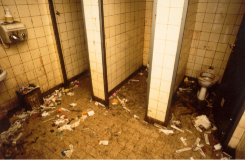
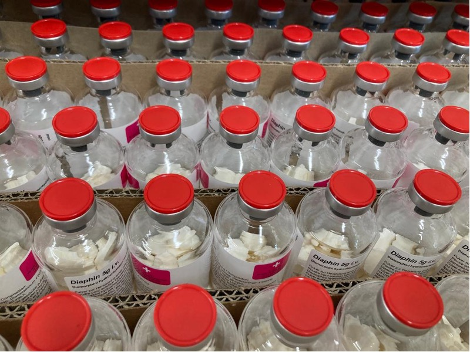
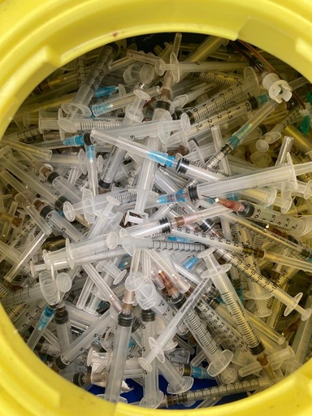

+++
title = "Die Drogensucht auf den Strassen von Bern"
date = "2023-05-08"
draft = false
pinned = false
image = "unbenannt-kopie.jpg"
+++


Hunderte Drogenabhängige sind Tag und Nacht im Kocherpark und auf der Kleinen Schanze am Fixen. Es ist zur Gewohnheit geworden für die Bewohner*innen von Bern.                                                                                  Doch nun soll sich diese Situation auf einen Schlag ändern.



**Ein normales Bild anfangs der 90er Jahre** – laute Sirenen sind zu hören in der Stadt Bern.                Ambulanzen nähern sich der Kleinen Schanze, Alltag für die Sanitäter*innen, jedem ist bewusst ist, was auf der Kleinen Schanze vor sich geht.

Chaos herrscht, die Kleine Schanze ist nicht mehr begehbar, nur noch die Suchtkranken sind dort zu finden, viele liegen herum, spritzen unter freiem Himmel, andere liegen bewusstlos da und im schlimmsten Fall haben sie eine Überdosis.                                                                                                                                                      Heroin war oft zu rein oder mit fremden Stoffen gestreckt, sodass lebensbedrohliche Überdosen zum Alltag gehörten, erzählte Frau Moos, eine Zeitzeugin. 

**Das Leben auf der Strasse**

Keine Vorstellung oder eigene Erfahrung aus dieser Zeit und trotzdem wird der Kocherpark noch heute als Mittelpunkt der Drogenszene gesehen. Doch was viele nicht wissen, ist, dass die Kleine Schanze schon vorher, wie auch nachher der Treffpunkt der Drogenszene war. 

Die Gegend um das Bundeshaus war ebenfalls betroffen von der Drogenszene. Viele Fixer\*innen und auch Alkoholiker\*innen konsumierten ihre Substanzen und bettelten, diese offene Drogenszene tangierte ganz Bern und war schweizweit im Fokus. Zwischen Kleiner Schanze und dem Hotel Bellevue etablierte sich zudem die Prostituiertenszene. Die Betroffenen waren bereit, alles aufzugeben, selbst die eigene Würde, indem sie ihren Körper verkauften.  

Hunderte Fixer*innen sind tagsüber im Kocherpark, doch für die meisten ist er zum zuhause geworden. 

Dank der damals gefällten Entscheidung der Stadtregierung Bern wurden vor 30 Jahren der Kocherpark sowie die Kleine Schanze wieder zu einem öffentlich begehbaren Ort gemacht. Bevor dies geschehen konnte, musste der Boden zwei Meter tief abgetragen werden. Der Rasen sowie der ganze Park waren vergiftet von den Drogen und Spritzen, welche über mehrere Jahre hinweg in dieser Anlage konsumiert wurden.                    Ein entscheidender Schritt zur Besserung der Situation war die Revision des Betäubungsmittelgesetzes mit der Ermöglichung der kontrollierten Drogenabgabe.

**Die Geschichte der Drogenpolitik in der Schweiz**

In den 1960er Jahren begann die neuere Geschichte der Drogenpolitik, da es einen Anstieg des Drogenkonsums gab. Erste Herointote gab es in der Schweiz im Jahr 1972. In den 1980er Jahren gab es eine starke Zunahme der Zahl der Drogenabhängigen, worauf die offene Drogenszene im Jahr 1987 in verschiedenen Schweizer Städten entstand. 1994 wurde das Projekt für eine ärztliche Verschreibung von Betäubungsmitteln gestartet und daraufhin wurde die Volksinitiative «Jugend ohne Drogen» 1997 mit 70.7% verworfen. Ebenso wurde die Volksinitiative «Droleg, für eine vernünftige Drogenpolitik» mit 73.9% verworfen. Kurze Zeit später nach dem Bundesbeschluss über die ärztliche Verschreibung von Heroin durften Ärzte in endsprechenden Zentren (zBsp. KODA) Heroin verschreiben. Zehn Jahre später sind die ersten heroingestützten Behandlungen gesetzlich verankert und eröffnet worden. Die Vier-Säulen-Politik wurde mit der Revision des Betäubungsmittelgesetzes in Kraft gesetzt, um der Heroinepidemie entgegenzuwirken. Das Prinzip dieses Modells, ist den Drogenkonsum und seine negativen Folgen zu minimieren.                               Die vier Säulen sind Prävention, Therapie, Schadensminderung und Repression. Durch die Entstehung der heroingestützten Behandlungen konnten folgende Zielsetzungen aufgesetzt und erfüllt werden: Dauerhafte therapeutische Einbindung, Verbesserung des physischen und psychischen Gesundheitszustandes und der sozialen Integration der Suchtabhängigen, risikoarmer Konsum und das Erschaffen von Bedingungen für eine dauerhafte Abstinenz, die Distanzierung der Suchtkranken von der Drogenszene und Verhinderung der Beschaffungskriminalität.

**Gross werden mit der Herausforderung der Abhängigkeit**

«Droge verändere eim zum Negative», so sagt eine 45-jährige suchtkranke Frau aus Bern. Sie hat die Blüte der Drogenszene in Bern miterlebt und erzählt aus erster Hand über ihre Erfahrungen mit der Drogensucht. 

Mit vierzehn begann alles, von einem eher harmlosen Joint bis zum alltäglichen Heroinkonsum innerhalb drei Jahren. Während dieser kurzen Zeit veränderte sich ihr Leben drastisch und für immer. Sie sagt, sie habe alles verloren: ihre Familie, ihre Freunde und ihren Traumjob. Bis heute hat sie keinen Kontakt mehr zu ihrer Mutter, welche wegen der Drogensucht ihrer Tochter in eine Krise verfallen ist.                                                                Als sie mit 18 Jahren in das biwak in Burgdorf eingetreten war, versuchte Frau Moos von den Drogen wegzukommen, bis 28 war sie in Burgdorf und versuchte ihr Bestes, um ihre Sucht zu überwinden – es funktionierte nicht und sie zog nach Bern in eine betreute WG. Anfangs der 90er Jahre entstand die Drogenszene in Bern und Frau Moos wurde mit dem Leben auf der Gasse konfrontiert.                                      Es war eine Herausforderung, nicht in die Drogenszene hineinzugeraten. Die Drogenszene war taff, man klaute, man bettelte und man hatte keine Freunde, es war eine Zweckgemeinschaft. 

> ***«Ig bi eifach blind gsy»***

Drogen lösen Sorgen von selbst und man fühlt sich befreit, doch was einem erst bewusst wird, wenn man mittendrin im Drogenkonsum ist, ist dass man blind geworden ist und nicht mehr durchblicken kann. Diese Erfahrung musste Frau Moos bereits im Alter von 18 Jahren machen. «I bi eifach blind gsy», mit dieser Aussage begann Frau Moos zu erzählen, was Drogen für eine einschneidende Rolle in ihrem Leben spielten. Sie habe ihre Mutter betrogen, ihre Grossmutter bestohlen und wurde egoistisch erst Jahre später wurde ihr klar, was die Drogen mit ihr machten. Nun wusste sie, dass sich diese Situation ändern muss.

»Drogen mache eim egoistisch», so berichtet Frau Moos über ihre Vergangenheit, in welcher sie es selbst erlebt hatte, egoistisch zu sein. Als sie hauptsätzlich in der Drogenszene lebte, war ihr alles andere als bewusst, wie schlimm es war, dass sich alle ausnützten, die Beste war man nur, wenn man Geld hatte, um Drogen zu besorgen, Helfen war etwas, was man nie tat. Frau Moos sagt mit bedrückter Stimme: «Was mi haut eifach trurig dünkt, sie göh eifach über Lichene, die Drogesüchtige».                                                         Erst durch die Pandemie im Jahre 2020 wurde ihr bewusst, sie musste etwas in ihrem Leben ändern. Es waren immer weniger auf der Strasse während der Pandemie, es war schwierig, an Drogen zu kommen, man musste immer mehr betteln, um überhaupt eine Möglichkeit zu haben, an Drogen zu gelangen. Das war der Zeitpunkt, an dem sie ihr Leben in den Griff bekommen wollte. Die KODA ist in erster Linie eine Überlebenshilfe, so antwortete Frau Moos auf die Frage, inwiefern sich die KODA auf ihr Leben ausgewirkt hat. Sie hat nicht damit gerechnet, dass sie mit 45 Jahren noch in der KODA sein würde.                                                                           Ob sie die Vergangenheit zurückdrehen würde, wenn sie könnte, darauf antwortete sie mit einem klaren Ja. Ihre Vergangenheit ist anders verlaufen, als sie es sich erwünscht hatte. Sie wollte Krankenschwester werden, doch dies ist nicht mehr möglich. Sie hat alle ihre Freunde und ihre Familie verloren. «Vor fünf bis sechs Jahren hatte ich weder Träume noch Wünsche» sagte sie enttäuscht. Wenn sie jetzt an ihre Vergangenheit zurückdenkt, gibt es sicher Vieles, was sie anders machen würde, doch ohne Vergangenheit wäre sie heute nicht der Mensch, welcher sie jetzt ist. Um dieses Leben immer mehr in den Griff zu bekommen, erhält sie bis heute grosse Unterstützung durch die KODA in Bern.

Die 45-jährige Frau konnte durch die KODA ihren Drogenkonsum einschränken und erhält noch heute finanzielle und psychiatrische Unterstützung. Sie hat wieder Wünsche und Träume und durch ihren Blindabbau des Heroins wird es ihr vielleicht möglich sein, in naher Zukunft ihre Träume zu verwirklichen.



Blindabbau, d. h. der Patient wird nicht genau über die Menge der jeweils verordneten Medikation informiert, um Fixierungen auf die jeweilige Dosis zu vermeiden.



**Unterstützung ist ein ausschlaggebender Aspekt in Richtung Abstinenz** 

Eine grosse Hilfe für die Suchtkranken war die Entstehung verschiedener kontrollierter Heroinabgabestellen. Es gibt mittlerweile verschiedene Institutionen, die die Drogenabhängigen unterstützen. Die KODA ist eine der grössten kontrollierten Heroinabgabestellen. Sie befindet sich in Nähe des Eigerplatzes. Die KODA wurde mit dem Ziel der Schadensminderung ins Leben gerufen. Dort wird den Drogenabhängigen reines Heroin in vorbereiteter Dosierung mit sterilen Spritzen oder in Tablettenform in einem sterilen Raum verabreicht. Dies hat zur Folge, dass es weniger Beschaffungskriminalität, weniger Prostitution und sinkende Gesundheitskosten gibt. Zudem hat man in den meisten Institutionen einen zugeteilten Psychologen oder Psychiater, welcher die Suchtabhängigen betreut und psychisch unterstützt. 

Die Behandlungsziele einer solchen Institution sind das Überleben zu sichern, die Stabilisation im psychischen, gesundheitlichen und sozialen Bereich und das Distanzieren der Drogenszene; Weg vom risikoreichen, illegalen und legalen Suchtmittelkonsum. Dadurch Reduktion von Beschaffungskriminalität, Prostitution und sozial auffälligem Verhalten. Somit Ermöglichung am gesellschaftlichen Leben wieder teilzunehmen und soziale Kontakte ausserhalb der Szene zu erlangen. Erreichen einer stabilen privaten Situation und das Übernehmen von Selbstverantwortung. Stabilisierung durch die kontrollierte Medikamentenabgabe oder Erreichen der Abstinenz von legalen und illegalen Suchtmitteln.

Eine weitere Organisation im Bereich der Schadensminderung ist die Anlaufstelle der Stiftung Contact. Sie bietet sterile Spritzen und Nadeln, Abgabe von Konsumationsmaterial, überwachte Konsumräume und medizinische Erstversorgung im Gegensatz zur KODA werden aber keine Betäubungsmittel abgegeben, sondern eigens mitgebrachte Substanzen konsumiert. Die Anlaufstelle sowie die KODA richten sich an alle über 18-Jährigen, die illegale Drogen konsumieren. 

Im Verlaufe der Jahre hat sich vieles verändert, im medizinischen Bereich sowie auch im sozialen Bereich der Drogenabhängigen. Herr Dr. Brandt, Leitender Arzt der KODA erzählt, dass sich über die Jahre die Substanzen verändert haben, wie beispielsweise Heroin. Früher war es eine Substanz, die von vielen Leuten regelmässig konsumiert wurde. Heutzutage ist es eher weniger der Fall. Es werden mehr Stimulanzien konsumiert. Was sich auch verändert hat sind die Auswirkungen, sagte Dr. Brandt. Was viele erstaunt, ist, dass man vielen gar nicht ansieht, dass sie konsumieren, vor allem bei Jugendlichen. Er erzählt, dass mit der Suchterkrankung oftmals psychotische Grunderkrankungen einhergehen und durch die Behandlungen, welche die Betroffenen erhalten können, wird nicht nur die Sucht behandelt, sondern auch die Pathologie. 

Das Leben auf der Gasse in den Griff zu bekommen, scheint unmöglich und doch gibt es Fälle, in welchen es den Suchtkranken möglich wird, wieder ein normales Leben zu führen. Die KODA ist eine grosse Unterstützung in Richtung Abstinenz, da die Betroffenen psychisch sowie gesundheitliche unterstützt werden. Frau Moos, die seit Jahren damit zu kämpfen hat, ist auf dem Weg ihre Drogensucht hinter sich zu lassen. Ihr Alltag ist zurückgekehrt, sie arbeitet, hat eine Wohnung und keinen Nebenkonsum mehr. Eine grosse Rolle auf diesem Weg spielte auch die Räumung der offenen Drogenszene in Bern. Dadurch dass es keine offizielle Drogenszene mehr gibt, fällt es ihr einfacher, keinen Nebenkonsum zu haben. Somit ist es nun auch anderen möglich die Drogensucht zu kontrollieren oder sich von ihr zu verabschieden und zurück in einem gesunden Leben zu treten.