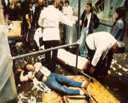

+++
title = "Drogenszene Bern"
date = "2023-03-20"
draft = false
pinned = false
image = "unbenannt.jpg"
+++
**Ein normales Bild anfangs 90er Jahre** - laute Sirenen sind zu hören in der Stadt Bern.

Ambulanzen nähern sich der Kleinen Schanze, Alltag für die Sanitäter, da es jedem bewusst war, was auf der Kleinen Schanze vor sich geht.

Chaos herrscht, die Kleine Schanze ist nicht mehr begehbar, nur noch die Suchtkranken sind dort zu finden, viele liegen rum, spritzen unter freiem Himmel - andere liegen bewusstlos und im schlimmsten Fall haben sie eine Überdosis. 

Heroin war oft zu rein oder mit fremden Stoffen gestreckt, sodass eine lebensbedrohliche Überdosis zum Normalfall gehörte.

Ohne viel Ahnung wird der Kocherpark als Mittelpunkt der Drogenszene angesehen. Doch was viele nicht wissen, ist dass die Kleine Schanze schon vorher, wie auch nachher der Treffpunkt der Drogenszene war. 

Auch das Bundeshaus war von der Drogenszene betroffen, viel Alkoholiker\*innen und Fixer\*innen konsumierten ihre Substanzen und bettelten, teilweise sogar wichtige Persönlichkeiten des Bundeshauses. 

Die Strecke zwischen Kleiner Schanze und Bellevue war oft umgeben von Prostituierten. Es war der Ort, an dem sich viele prostituierten. 

Die Betroffenen waren bereit, alles aufzugeben, sogar die eigene Würde, indem sie ihren Körper verkauften. 

Hunderte Fixer gehen ein und aus, doch die meisten haben sich den Kocherpark als Zuhause gemacht. 

Dank der dazumal gefällten Entscheidung der Stadtregierung Bern wurde vor 30 Jahren der Kocherpark sowie die Kleine Schanze wieder zu einem öffentlich begehbaren Ort gemacht, bevor dies geschehen konnte, musste der Boden zwei Meter tief abgetragen werden. Der Rasen sowie der ganze Park waren vergiftet von den Drogen und Spritze, welche über mehrere Jahre hinweg in dieser Anlage konsumiert wurden.

Ein entscheidender Schritt zur Verbesserung der Situation war die Revision des Betäubungsmittelgesetzes mit der Ermöglichung der Kontrollierten Drogenabga